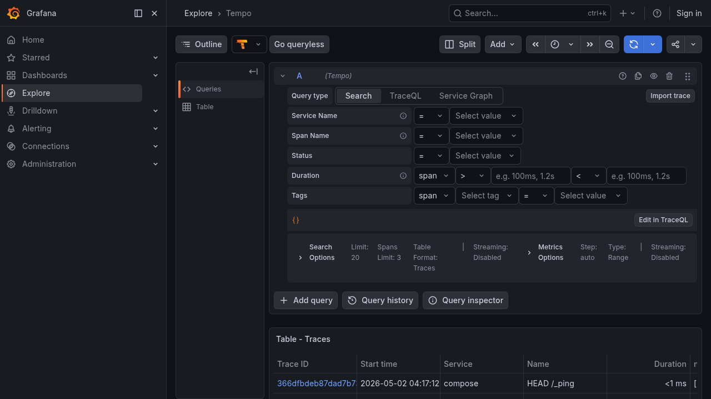
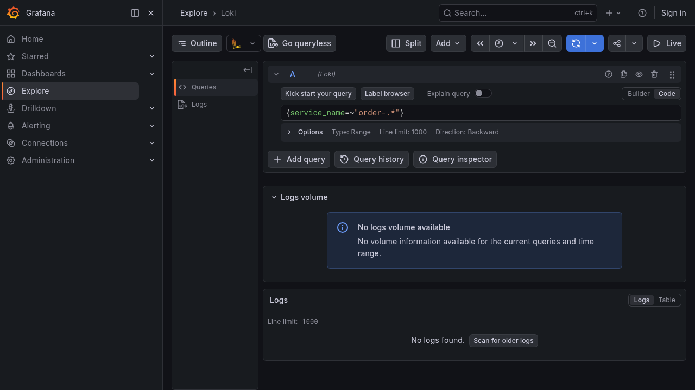
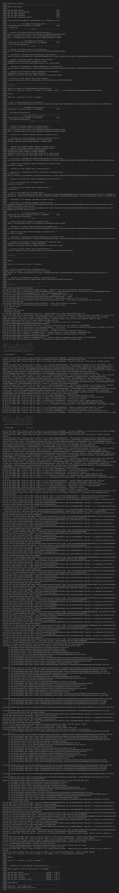

# OSE OTel Demo

A workshop-grade demo that teaches engineers how to instrument a Spring Boot 3.4.13 / Java 17 application using the OpenTelemetry Java SDK directly — manual instrumentation, no `-javaagent` and no Micrometer bridge. The demo covers two of the most common service-to-service shapes (synchronous HTTP and asynchronous RabbitMQ producer/consumer) and emits all three OpenTelemetry signals — traces, metrics, and logs — to Grafana's `otel-lgtm` all-in-one backend.

The workshop progresses through six annotated git tags: `step-01-baseline` → `step-02-traces` → `step-03-context-propagation` → `step-04-metrics` → `step-05-logs` → `step-06-tests`. You can `git checkout` any tag to time-travel through the workshop. The current `main` branch as of `step-01-baseline` shows the **uninstrumented baseline** — both Spring Boot apps run end-to-end with `POST /orders` flowing through RabbitMQ, but with **zero OpenTelemetry libraries on the classpath**. Phase 2 onward adds the SDK.

## Prerequisites

You will run two Spring Boot apps on your laptop's JVM and two infrastructure containers (RabbitMQ + grafana/otel-lgtm) via Docker. Before starting, verify your environment with `mise run preflight`.

### Required tools

| Tool                       | Version      | Install                                                  |
|----------------------------|--------------|----------------------------------------------------------|
| mise                       | `≥ 2025.1.0` | `curl https://mise.run \| sh`                            |
| Docker Engine + Compose v2 | `≥ 24.0`     | https://docs.docker.com/engine/install/                  |
| Git                        | `≥ 2.30`     | `brew install git` / `apt install git` / `pacman -S git` |

mise will install the right JDK and Maven for you on first `mise install`:

| Auto-installed via mise   | Version                  |
|---------------------------|--------------------------|
| Amazon Corretto JDK       | `corretto-17.0.13.11.1`  |
| Apache Maven              | `3.9.11`                 |

### Required free ports

| Port  | Service                | Why                                          |
|-------|------------------------|----------------------------------------------|
| 3000  | Grafana UI             | Common collision (React/Next.js dev servers) |
| 4317  | OTLP gRPC ingest       | Used from Phase 2 onwards                    |
| 4318  | OTLP HTTP ingest       | Reserved for HTTP-fallback variant           |
| 5672  | RabbitMQ AMQP          | Standard AMQP port                           |
| 15672 | RabbitMQ Management UI | Standard management port                     |
| 8080  | producer-service HTTP  | Spring Boot default                          |
| 8081  | consumer-service HTTP  | `/actuator/health` only                      |

If a port is in use, `mise run preflight` will tell you which one and suggest `lsof -i:<port>` to identify the conflicting process.

### IDE setup

If you use **IntelliJ IDEA**: install the [Mise plugin](https://plugins.jetbrains.com/plugin/24009-mise) OR ensure IntelliJ's "Project SDK" points at the mise-installed Corretto JDK (run `mise where java` to print the absolute path). The committed `.tool-versions` file enables IntelliJ's built-in auto-detection as a fallback.

If you use **VS Code**: install the [Mise extension](https://marketplace.visualstudio.com/items?itemName=hverlin.mise-vscode).

### One-time setup

```sh
git clone https://github.com/cotocisternas/ose-otel-demo
cd ose-otel-demo
mise install        # installs the Corretto JDK + Maven versions pinned in mise.toml
mise run preflight  # validates everything before you start
```

### First run

```sh
mise run infra:up   # starts RabbitMQ + grafana/otel-lgtm
mise run dev        # starts producer + consumer in parallel
# in a second terminal:
mise run demo:order # POSTs a sample order; expect 202
```

You should see the consumer log a line like: `OrderCreated received: orderId=<uuid>`.

In Phase 1 there is **no telemetry** — the OTLP endpoint is open and the Grafana stack is running, but the apps emit nothing. This is intentional: Phase 2 introduces the OpenTelemetry SDK and traces start flowing. To verify the baseline: `mise run verify:bom` should report zero OpenTelemetry libraries on the classpath.

## Workshop checkpoints

- `step-01-baseline` — Working two-service Spring Boot + RabbitMQ app on host JVM with ZERO telemetry.
- `step-02-traces` — Manual SDK bootstrap; producer and consumer emit DISCONNECTED traces (intentional setup for the Phase 3 propagation lesson).
- `step-03-context-propagation` — THE headline lesson: AMQP context propagation joins the two traces; `consumer.parentSpanId == producer.spanId` after this checkpoint.
- `step-04-metrics` — `SdkMeterProvider` lands as a sibling pipeline next to the tracer pipeline; `orders.created` (Counter), `http.server.request.duration` (Histogram, seconds), `orders.queue.depth.estimate` (ObservableGauge) flow to Mimir on a 10-second interval.
- `step-05-logs` — Logs correlation + Loki-to-Tempo click-through.
- `step-06-tests` — Cross-service Testcontainers IT proves the full instrumentation chain in CI. **Current.**

This section establishes the convention; the per-step walkthroughs below follow a uniform 5-section template — *What you'll learn* / *Checkpoint* / *Run* / *What to look for* / *Why it matters* — so you can read the workshop top-to-bottom or skip into any step. The load-bearing standalone narrative sections ("Reading the code", "Why is OtelSdkConfiguration.java duplicated?", "Why is the propagation pair shared?", "What's NOT here yet") are preserved as a Concepts & FAQ appendix at the bottom; per-step *Why it matters* paragraphs cross-reference them where relevant.

## Step 1: Baseline & Scaffold

### What you'll learn

What a working two-service Spring Boot + RabbitMQ application looks like with **zero OpenTelemetry libraries on the classpath**. The baseline that every later step instruments — neutralised foundation pitfalls (BOM ordering, ports, mise/IDE) so every subsequent OTel lesson is uncontaminated by tooling friction.

### Checkpoint

`git checkout step-01-baseline` — first commit; nothing to compare against.

### Run

```sh
mise run preflight   # Docker up, ports free, JDK 17, Maven 3.9 active
mise run infra:up    # starts RabbitMQ + grafana/otel-lgtm
mise run dev         # starts producer + consumer in parallel
mise run demo:order  # POSTs a sample order; expect 202
mise run load        # OPTIONAL — continuous load (~1 req/sec, 50/50 priorities)
```

`mise run load` is the workshop's continuous-load script (Phase 7 / WORK-03). It launches two parallel `oha` invocations alternating `priority=express` and `priority=standard` at ~0.5 req/sec each (~1 req/sec total). Run it in a second terminal alongside `mise run dev` so live demos have flowing telemetry without hand-clicking. Ctrl-C terminates both child loaders cleanly.

### What to look for

- **Producer console**: `Started ProducerApplication in <Ns>`, then `OrderCreated` accept lines on every `mise run demo:order`.
- **Consumer console**: `OrderCreated received: orderId=<uuid>` per published order.
- **Grafana** (`mise run ui:grafana` — opens `http://localhost:3000`, **no login required**; anonymous Admin access is enabled by docker-compose so workshop attendees never see a password prompt): the pre-provisioned **OSE OTel Demo — Three Signals** dashboard appears in the dashboard list automatically — but **all panels are empty**. The dashboard's two-row layout (top = projector-friendly demo strip; bottom = collapsed deeper-dive) IS the workshop's pedagogical message: small demo, bigger production glimpse.
- **`mvn dependency:tree -Dincludes=io.opentelemetry`**: zero matches. There are no OTel libraries on the classpath yet.
- **Tempo trace search** (Grafana → Explore → Tempo): zero traces ever, no matter how many orders you POST.



### Why it matters

Every subsequent step adds **one** OTel surface to this baseline. The empty Tempo view IS the lesson — until Phase 2 wires `OpenTelemetrySdk.builder()`, the OTLP endpoint is open and the Grafana stack is running, but the apps emit nothing. This intentional *uninstrumented* shape lets each later step's diff read as a focused addition rather than a tangled refactor. The continuous-load script also sneaks in a tiny instrumentation lesson: while `mise run load` is running, `oha`'s TUI shows live RPS + p50/p95/p99 latency in the same terminal pumping load — a side-by-side "client view vs server view" preview of what `http.server.request.duration` will eventually show in Mimir from Phase 4 onwards. See the *What's NOT here yet* entry in the Concepts & FAQ appendix for the full list of deliberate Phase 1 omissions.

## Step 2: Manual SDK Bootstrap & First Traces

### What you'll learn

The smallest possible OpenTelemetry surface — `OpenTelemetrySdk.builder()` + `Resource` + `SdkTracerProvider` + `BatchSpanProcessor` + `OtlpGrpcSpanExporter` + explicit `Sampler.parentBased(Sampler.alwaysOn())` + graceful shutdown — wired manually in EACH service. Plus span-kind discipline: SERVER + INTERNAL + PRODUCER on the producer; CONSUMER + INTERNAL on the consumer. The broken-propagation state is INTENTIONAL — Phase 3 fixes it.

### Checkpoint

`git checkout step-02-traces` — adds `OpenTelemetrySdk` per-service + the inline span call sites. The producer trace and consumer trace appear separately in Tempo; they are not yet connected (that lands in Step 3).

### Run

```sh
git checkout step-02-traces
mise run infra:up
mise run dev
mise run demo:order
# then open Grafana -> Tempo Explore
```

### What to look for

- **Two distinct traces in Tempo** for one logical `POST /orders`: one with `service.name=order-producer`, one with `service.name=order-consumer`. They share NOTHING — no traceId, no parent/child link.
- **Producer trace structure**: SERVER span (`POST /orders` with HTTP semconv attributes `http.request.method`, `url.path`, `http.response.status_code`) wrapping an INTERNAL span (business logic).
- **Consumer trace structure**: CONSUMER span wrapping an INTERNAL span.
- **Service identity** — never `unknown_service:java`; both services emit correct `service.name` / `service.namespace` / `service.instance.id` / `deployment.environment.name` resource attributes (Phase 2 TRACE-02 + D-05).
- **Graceful shutdown**: press Ctrl-C on either app; the **last** batch of spans still appears in Tempo afterwards (`@Bean(destroyMethod = "close")` cascade flushes pending batches).

<table>
  <tr>
    <th align="center">Step 2 — broken (TWO disconnected traces)</th>
    <th align="center">Step 3 — fixed (ONE joined trace)</th>
  </tr>
  <tr>
    <td></td>
    <td></td>
  </tr>
</table>

Read the broken/fixed pair side-by-side. The same `POST /orders` call: two traces in Step 2, one trace in Step 3. The single-line propagation pair Phase 3 introduces is what closes the gap.

### Why it matters

The "brokenness" of unpropagated traces IS the phase deliverable. Every distributed-tracing implementation faces this exact moment — the SDK is wired, traces are flowing, services are correctly identified, but trace IDs are NOT yet shared across the messaging boundary. Reading two `OtelSdkConfiguration.java` files (one per service) and seeing the broken state in Tempo BEFORE seeing the fix anchors the propagation lesson Phase 3 lands. The per-service duplication of `OtelSdkConfiguration.java` is also intentional — see *Why is OtelSdkConfiguration.java duplicated?* in the Concepts & FAQ appendix for the rationale (so you don't "fix" the duplication by extracting a shared library and lose half the lesson). For the manual-SDK textbook tour, see *Reading the code* in the same appendix.

## Step 3: AMQP Context Propagation — THE Headline Lesson

### What you'll learn

The single-line addition that joins producer and consumer into ONE distributed trace — `propagator.inject(Context.current(), props, SETTER)` on the producer side and `propagator.extract(Context.current(), props, GETTER)` plus `.setParent(extracted)` on the consumer side. Plus the `recordException` + `setStatus(ERROR)` pattern on the deterministic 10th-order failure path.

### Checkpoint

`git checkout step-03-context-propagation` — adds the `TracingMessagePostProcessor` (producer-side inject) + `TracingMessageListenerAdvice` (consumer-side extract) pair from the shared `otel-bootstrap` Maven module, deletes Phase 2's inline producer/consumer span bodies, and wires the deterministic-failure error path. The single-line `.setParent(extracted)` on the consumer span makes `consumer.parentSpanId == producer.spanId`.

### Run

```sh
git checkout step-03-context-propagation
mise run infra:up
mise run dev
mise run demo:order              # one normal order
for i in $(seq 1 10); do mise run demo:order; done   # trigger the 10th-order failure
```

### What to look for

- **One trace** in Tempo for one `POST /orders`: producer + consumer spans share `traceId`; the consumer span's `parentSpanId` equals the producer span's `spanId`. (Re-read Step 2's broken/fixed pair above — same call, two-traces-vs-one.)
- **`traceparent` header** in the message: open RabbitMQ Management UI (`mise run ui:rabbitmq`, `guest/guest`), inspect any `orders.created` message, and see a readable `traceparent: 00-<32-hex>-<16-hex>-01` value. **Never** `[B@...` or hex-blob byte-array signatures (PITFALLS.md #2 — String, not `byte[]`).
- **Error-status propagation across the AMQP hop**: every 10th order triggers `ProcessingFailedException` in the consumer; Tempo renders that trace as `Error` status with the exception event attached to the consumer span (`recordException` + `setStatus(ERROR)`).
- **Symmetry of one inject method matched by one extract method**: open `otel-bootstrap/src/main/java/com/example/otel/amqp/` and read `TracingMessagePostProcessor` next to `TracingMessageListenerAdvice`. The structural symmetry IS the lesson.

(Optional: a waterfall capture of the joined trace lives at [`docs/screenshots/step-03-waterfall.png`](docs/screenshots/step-03-waterfall.png) for projector use.)

### Why it matters

Phase 3 is the workshop's headline lesson. The broken-then-fixed delta from Step 2 is the artifact's most powerful pedagogical moment — `git diff step-02-traces..step-03-context-propagation` shows a small, readable changeset focused on the propagation pair, and Tempo renders the consequence visually. The propagation pair lives in a shared module on purpose — exactly the OPPOSITE design choice from the per-service-duplicated SDK bootstrap. See *Why is the propagation pair shared?* in the Concepts & FAQ appendix for the contrast (per-service code is duplicated so attendees read it twice; cross-service code is shared so attendees read ONE inject method matched by ONE extract method, and the symmetry IS the lesson). Phase 3 also corrects an OTel messaging-semconv divergence from Phase 2 — the producer's `messaging.destination.name` attribute is now the **exchange** (`orders`), not the queue (`orders.created`). The error-status propagation across the AMQP hop is itself a teaching moment: the consumer span carries `Status.ERROR` with the recordException event because the extracted-and-attached parent context lets `Span.current()` return the right span at the listener body's catch block.


## Step 4: Metrics

### What you'll learn

Three OTel instrument shapes — `LongCounter` (`orders.created`), `DoubleHistogram` (`http.server.request.duration`, **seconds**), and `ObservableLongGauge` (`orders.queue.depth.estimate`) — wired into both services as a sibling pipeline alongside the existing trace pipeline, with a 10-second `PeriodicMetricReader` interval that overrides OTel's 60-second default.

### Checkpoint

`git checkout step-04-metrics` — adds `SdkMeterProvider` per service. The diff against `step-03-context-propagation` reads as "we added a sibling pipeline next to the trace pipeline" because Phase 4 D-01 extracted Phase 2's inline tracer pipeline into `private SdkTracerProvider buildTracerProvider(Resource)` and added a sibling `private SdkMeterProvider buildMeterProvider(Resource)`. Zero new dependencies (`opentelemetry-exporter-otlp` ships traces + metrics + logs from one jar; on classpath since Phase 2).

### Run

```sh
git checkout step-04-metrics
mise run infra:up
mise run dev
mise run demo:order        # alternates priority=express + priority=standard
mise run load              # in another terminal — populates per-priority panels
```

### What to look for

- **`orders_created_total`** in Mimir (Grafana → Explore → Prometheus): increments on every successful POST. Two series — `order_priority="express"` and `order_priority="standard"`. **Note the name mangling**: the OTel-to-Prometheus exporter (running inside `otel-lgtm`'s collector) converts dots to underscores and appends `_total` for monotonic counters, so OTel-side `orders.created` surfaces as Prometheus `orders_created_total`. The counter does NOT fire on the failure path (D-08) — failures are visible via the trace's ERROR status, not as a metric.
- **`http_server_request_duration_seconds`** (Histogram, **seconds**): query `histogram_quantile(0.95, sum by (le) (rate(http_server_request_duration_seconds_bucket[1m])))` for p95. **Unit is seconds (`"s"`), not milliseconds.** The seconds-not-millis trap (Phase 4 D-13) is the textbook OTel-porting mistake — semconv 1.40.0 specifies seconds, and Mimir's default `http_server_request_duration_seconds` dashboards assume seconds. Attributes follow HTTP semconv: `http.request.method` and `http.response.status_code` only — `url.path` is intentionally excluded for cardinality reasons.
- **`orders_queue_depth_estimate`** (ObservableGauge, consumer-side): a synthetic value from `ThreadLocalRandom.current().nextInt(0, 50)` reported on every 10-second collection cycle. The `PeriodicMetricReader` interval is set to **10 seconds** (METRIC-01 — overrides OTel's 60-second default; this is the difference between "fresh metric every demo" and "wait a minute every demo").
- **Attribute-key contrast** — `order.priority` is a string-literal `AttributeKey<String>` because it is NOT in the OTel semconv catalog (a *business* attribute), while `http.request.method` and `http.response.status_code` come from `HttpAttributes.HTTP_REQUEST_METHOD` and `HttpAttributes.HTTP_RESPONSE_STATUS_CODE` (semconv constants from `io.opentelemetry.semconv:1.40.0`).
- **Same Resource attributes on every metric data point** — `service.name`, `service.namespace`, `service.instance.id`, `deployment.environment.name` (Phase 4 D-05 — Resource built once and shared between tracer + meter pipelines for cross-signal correlation in Grafana).

<!-- TODO(DOC-04 v1.x): docs/screenshots/step-04-metrics.png — Mimir RED metrics panel.
     Capture deferred per Phase 7 wave-4 SUMMARY (07-04); referenced here as a placeholder
     so the screenshot embed can be re-introduced without re-touching the surrounding prose.
     Until then, the dashboard URL below carries the visual: open the auto-provisioned
     "OSE OTel Demo — Three Signals" dashboard at http://localhost:3000/d/ose-otel-demo with
     `mise run load` running in another terminal — the per-priority `orders_created_total`
     panel and the `http_server_request_duration_seconds` p50/p95/p99 panel populate live. -->

### Why it matters

The three instrument shapes cover OTel's primary metric kinds. The textbook traps Phase 4 surfaces — seconds-not-millis, dots-to-underscores name mangling, the 60-second-vs-10-second reader interval, semconv-vs-business attribute keys — are the specific shapes that bite teams porting from custom metrics libraries. The "sibling pipeline" structure is a deliberate carryforward from Phase 2's helper extraction; the diff against the previous tag reads as a focused addition, not a tangled refactor. For why both services repeat the same `OtelSdkConfiguration.java` shape rather than sharing one — see *Why is OtelSdkConfiguration.java duplicated?* in the [Concepts & FAQ](#concepts--faq) appendix.

## Step 5: Logs Correlation

### What you'll learn

The third OTel signal — logs — wired alongside traces and metrics, plus MDC `trace_id`/`span_id` injection so terminal output is correlatable without leaving the workshop laptop. The load-bearing PITFALL #5 mitigation: `OpenTelemetryAppender.install(sdk)` runs INLINE in the `@Bean` factory body so Logback's pre-Spring initialization doesn't pin the appender to `OpenTelemetry.noop()`.

### Checkpoint

`git checkout step-05-logs` — adds `SdkLoggerProvider` next to `SdkTracerProvider` and `SdkMeterProvider`, plus a per-service `logback-spring.xml` with the `OpenTelemetryAppender` (OTLP export) wrapped by the MDC injector wrapper appender. Commit `f5c331a` is the load-bearing fix moving `OpenTelemetryAppender.install(...)` into the `@Bean` factory body — `git show f5c331a` for the bug-fix narrative.

### Run

```sh
git checkout step-05-logs
mise run infra:up
mise run dev
mise run demo:order
# then in Grafana → Explore → Loki:
#   {service_name="order-producer"} |~ "<traceId>"
```

### What to look for

- **Console output stamps `trace_id` / `span_id`**: every business-logic log line renders with `[trace_id=4b2e... span_id=ad12...]` in the bracketed pattern. Pre-`POST` startup logs render `[trace_id= span_id=]` (empty defaults via Logback's `%mdc{key:-}` syntax — that's the difference between "no active span" and "missing key").
- **Loki log lines carry the same `trace_id`**: in Grafana → Explore → Loki, run `{service_name="order-producer"} |~ "<traceId>"` (replace `<traceId>` with the 32-hex value from console). Click the `trace_id` field on a returned log line; Grafana opens the matching trace in Tempo's Explore tab. **Click-through working IS LOG-05.**
- **Triple-signal correlation on the failure path**: the deterministic 10th order fires `LOG.error` in the consumer's `ProcessingService` alongside `span.recordException(e)`. Loki query `{service_name="order-consumer"} | severity_text="ERROR"` returns the failure log; click its trace_id and Tempo shows the trace whose CONSUMER span carries the recordException event AND a metric data point in Mimir for the same priority/method. All three signals share the trace_id.
- **`severity_text="ERROR"` (not `|= "ERROR"`)** — the OTLP `OpenTelemetryAppender` ships the formatted message **without** a level prefix; the Logback level lands on the OTLP record as the `severity_text` field which Loki's OTLP receiver indexes as a detected field. A substring filter against the message body returns zero results because the formatted body is just `order processing failed: orderId=<uuid>`.
- **Two `OpenTelemetryAppender` classes in different packages** — `appender.v1_0.OpenTelemetryAppender` is the OTLP exporter (has the `install()` static); `mdc.v1_0.OpenTelemetryAppender` is an appender WRAPPER that reads `Span.current()` and stamps `trace_id`/`span_id` into MDC before forwarding. The MDC injector wraps `CONSOLE` so the bracketed pattern resolves correctly for in-span events.



### Why it matters

The `OpenTelemetryAppender.install(sdk)` order-of-operations is the textbook OTel logback gotcha (see [opentelemetry-java-instrumentation#10307](https://github.com/open-telemetry/opentelemetry-java-instrumentation/issues/10307)). Logback initializes BEFORE the Spring `ApplicationContext` is built, so the appender constructed at startup defaults to `OpenTelemetry.noop()`. Calling `install(sdk)` inside the `@Bean` factory body — immediately after `OpenTelemetrySdk.builder()...build()` returns and before `return sdk;` — avoids the Spring self-cycle a `@PostConstruct` shape would create AND tightens the window in which logs land in the noop replay queue. **The install-inline-in-the-`@Bean`-factory shape IS the lesson.** Commit `f5c331a` is the bug-fix narrative; reading the diff is itself part of the workshop. For the per-service-vs-shared design contrast (logs follow the same per-service-duplicated pattern as Phase 2's SDK setup), see *Why is OtelSdkConfiguration.java duplicated?* in the [Concepts & FAQ](#concepts--faq) appendix.

### Production-readiness callout: do not log untrusted payload fields

The Phase 5 business log lines deliberately mirror what application code
looks like **before** anyone has thought about log hygiene — the workshop
runs on a developer laptop with synthetic data, and "what raw application
logs look like" is part of the lesson. Two specific log sites would NOT
be safe in production and should be tightened before this code is copied
anywhere real:

- **`OrderController.create(...)`** —
  `LOG.info("received POST /orders payload={}", payload)` writes the
  entire `Map<String, Object>` request body to logs and Loki. Any field
  an attendee POSTs (free-form text, accidental secrets, credit-card-shaped
  strings) lands in log storage. The `Map.toString()` formatter does no
  CRLF escaping either — a `{"note":"hi\r\n[INFO] forged"}` payload
  injects a forged log line into the file/console that downstream parsers
  may treat as real.
- **`ProcessingService.process(...)`** —
  `LOG.error("order processing failed: orderId={}", orderId, e)` logs an
  attacker-controlled string from the message payload. The producer's
  `OrderPublisher` currently overwrites this field with a server-minted
  UUID, but that defense is one edit away — the consumer itself does not
  validate the `orderId` shape, so a CRLF in the field would inject a
  forged log line on the consumer side.

**Production fixes (out of scope for the workshop demo, in scope for any
real deployment of this code shape):** replace untrusted-payload logs
with explicit allowlisted fields (e.g. log only `priority` from the
controller body, or move the entry log into `OrderService.place(...)`
after the orderId is generated and log only that orderId); validate the
shape of fields read from messages at consumer ingress before they hit a
log line; or drop the field entirely and rely on the `trace_id` stamped
by the OpenTelemetryAppender as the correlation key (the workshop's
success criterion is "correlate via `trace_id`", not "via `orderId`").
Tracked under threat-model row T-05-04-01 (producer payload disclosure)
in `.planning/phases/05-logs-correlation/05-04-SUMMARY.md`; the
consumer-side concern is the symmetric case on the failure path.

## Step 6: Verification Tests

### What you'll learn

A CI-grade proof of the three-signal instrumentation chain — Testcontainers `RabbitMQContainer` + `InMemorySpanExporter` + `SimpleSpanProcessor` in a `@TestConfiguration` that asserts traceId shared, parentSpanId correct, span kinds correct, and messaging semconv attributes present. Caps the workshop with "now you can prove your instrumentation works in CI without a live OTLP backend."

### Checkpoint

`git checkout step-06-tests` — adds a top-level `integration-tests` Maven module with a single cross-service `OrderFlowIT.java`, a `TestOtelHolder` static-singleton, a `TestOtelConfiguration` `@TestConfiguration`, and a `<classifier>exec</classifier>` repackage execution on producer/consumer service POMs so the test module can depend on the plain classes jars while production builds still produce runnable fat jars.

### Run

```sh
git checkout step-06-tests
docker compose stop rabbitmq    # IMPORTANT — prove Testcontainers is genuinely used
mise run test                   # → mvn -T 1C verify; expect 4 green tests in Failsafe summary
```

The test exits non-zero on any assertion failure — suitable for any CI runner with Docker available.

### What to look for

- **Random RabbitMQ port in test logs**: a `@BeforeAll` line `RabbitMQ test container available at localhost:<random-port>` (e.g., `localhost:54321`) — NOT `localhost:5672`. With your host `docker compose` RabbitMQ stopped, the tests still pass — proof Testcontainers is genuinely used (TEST-01 SC #2).
- **Four green `@Test` methods** in the Failsafe summary covering the workshop's four signal areas:
  1. **traces** — producer + consumer spans share `traceId`; consumer's `parentSpanId == producer.spanId`; SpanKind set covers SERVER + INTERNAL + PRODUCER + CONSUMER + INTERNAL; messaging semconv attributes (`messaging.system=rabbitmq`, `messaging.operation_type=publish/process`).
  2. **logs** — producer-side `LOG.info` records carry the producer trace's `trace_id` (proves Phase 5's `OpenTelemetryAppender.install(...)` wiring still works through the test SDK).
  3. **metrics** — `orders.created` counter increments to 1 with `order.priority="express"`; `http.server.request.duration` histogram records the POST with `http.request.method=POST` + `http.response.status_code=202`.
  4. **failure path** — the 10th order's CONSUMER span has `Status.ERROR` + a recorded exception event; a `LOG.error` record carries the same trace_id (triple-signal correlation — the workshop's strongest single statement of "all three signals work together").
- **`SimpleSpanProcessor` + `InMemorySpanExporter` swap** — production wires `BatchSpanProcessor` + `OtlpGrpcSpanExporter`; tests use `TestOtelHolder` which builds the SDK with the synchronous `SimpleSpanProcessor` and the in-memory exporter from `opentelemetry-sdk-testing`. Every `span.end()` exports immediately — **NO Thread.sleep** in tests; Awaitility polling for async settling.
- **`<classifier>exec</classifier>` Maven trickery** — producer/consumer POMs publish TWO artifacts: the plain classes jar (default, exposes `ProducerApplication.class` directly on classpath) and a separate `-exec` repackaged executable fat jar. The integration-tests module depends on the plain jars so `new SpringApplicationBuilder(ProducerApplication.class, ...)` works. See `producer-service/pom.xml` for the canonical Spring Boot 3.4.13 syntax.
- **`TestOtelHolder` static-singleton** — the test-side replication of commit `f5c331a` ordering: `OpenTelemetryAppender.install(sdk)` runs AFTER `builder().build()` and BEFORE the SDK reference is published. The static-singleton resolves the @TestConfiguration vs @Bean bootstrap-ordering dance (06-CONTEXT.md D-07.1).
- **Two `SpringApplicationBuilder` contexts in one JVM** — `OrderFlowIT.@BeforeAll` starts both `ProducerApplication` and `ConsumerApplication` as separate Spring contexts in the same JVM, each `@Import`ing `TestOtelConfiguration`. The shared `TestOtelHolder` lets BOTH contexts emit spans into one `InMemorySpanExporter` — the only way to assert cross-service `traceId`/`parentSpanId` relationships in-process.



### Why it matters

Production-vs-test SDK divergence is a deliberate pedagogical contrast. Phase 2's per-service duplication of `OtelSdkConfiguration.java` is a PRODUCTION rule — `TestOtelConfiguration` is a single `@TestConfiguration` shared by both Spring contexts because the in-memory exporter must see ALL spans across both services in one queue. The contrast itself is the lesson: duplicate when readers benefit from reading the same setup twice; share when the test fixture's purpose requires one shared instance. The triple-signal correlation `@Test` (failure path) is the workshop's strongest single statement that all three signals work together — one trace_id, one error, one log, one metric data point, one in-memory queue per signal sink, one assertion suite. For the broader per-service-vs-shared design pattern, see *Why is the propagation pair shared?* and *Why is OtelSdkConfiguration.java duplicated?* in the [Concepts & FAQ](#concepts--faq) appendix.

## Reading the code

The two `OtelSdkConfiguration.java` files are the workshop's textbook for the manual SDK setup. Open them in your IDE and read top-to-bottom — every `@Bean` carries an inline comment explaining what each builder call does and why (DOC-03):

- [`producer-service/src/main/java/com/example/producer/config/OtelSdkConfiguration.java`](./producer-service/src/main/java/com/example/producer/config/OtelSdkConfiguration.java)
- [`consumer-service/src/main/java/com/example/consumer/config/OtelSdkConfiguration.java`](./consumer-service/src/main/java/com/example/consumer/config/OtelSdkConfiguration.java)

The producer adds one extra file — [`HttpServerSpanFilter.java`](./producer-service/src/main/java/com/example/producer/config/HttpServerSpanFilter.java) — that wraps every non-`/actuator/*` HTTP request in a `SERVER` span. The consumer has no inbound HTTP business surface so it does not register the filter.

The five business-code span sites (one `SERVER`, two `INTERNAL`, one `PRODUCER`, one `CONSUMER`) all use the same pure-inline `try`/`Scope`/`try`/`catch`/`finally` template — no helper, no AOP. The boilerplate IS the lesson.

## Why is OtelSdkConfiguration.java duplicated?

The two SDK config files are duplicated per service on purpose (DOC-05). Refactoring them into a shared `@AutoConfiguration` bean in the `otel-bootstrap` module would hide one of the two readings the workshop is built around — the whole point of Phase 2 is that an attendee reads `OpenTelemetrySdk.builder()`, `Resource.getDefault().merge(...)`, `BatchSpanProcessor.builder(...)`, `Sampler.parentBased(Sampler.alwaysOn())`, `OtlpGrpcSpanExporter.builder().setEndpoint(...)`, and `ContextPropagators.create(...)` _twice_, in two slightly different files, and develops a feel for which lines are workshop-pedagogy boilerplate and which lines are service-identity. The two files differ in only five small ways (package, JavaDoc cross-reference, the service.name string, the tracer scope name, plus the producer-only `HttpServerSpanFilter` bean) — the diff is small enough to read in one viewing. The propagation pair Phase 3 introduces, by contrast, IS shared in `otel-bootstrap` because the symmetry of one inject method matched by one extract method IS that lesson. Different design forces drive different choices; the workshop teaches both.

## Why is the propagation pair shared?

The propagation pair lives in `otel-bootstrap/src/main/java/com/example/otel/amqp/` (PROP-04) and is shared across both services on purpose — the deliberate counterpart of Phase 2's per-service-duplicated `OtelSdkConfiguration.java`. Read these two callouts as a pair: per-service code (the SDK setup) is duplicated so attendees read it twice; cross-service code (the messaging boundary) is shared so attendees read ONE inject method matched by ONE extract method, and the symmetry IS the lesson.

The shared module exports four classes:

- [`TracingMessagePostProcessor.java`](./otel-bootstrap/src/main/java/com/example/otel/amqp/TracingMessagePostProcessor.java) — `MessagePostProcessor` that opens a `PRODUCER` span, calls `propagator.inject(Context.current(), props, SETTER)`, and ends. Wired on the producer's `RabbitTemplate` via `setBeforePublishPostProcessors(...)` in `RabbitConfig.rabbitTemplate(...)`.
- [`TracingMessageListenerAdvice.java`](./otel-bootstrap/src/main/java/com/example/otel/amqp/TracingMessageListenerAdvice.java) — `MethodInterceptor` that calls `propagator.extract(Context.current(), props, GETTER)` and opens a `CONSUMER` span with `.setParent(extracted)` — the SINGLE LINE that makes `consumer.parentSpanId == producer.spanId`. Wired on the consumer's listener container factory via `setAdviceChain(...)` in `RabbitConfig.rabbitListenerContainerFactory(...)`.
- [`MessagePropertiesSetter.java`](./otel-bootstrap/src/main/java/com/example/otel/amqp/MessagePropertiesSetter.java) and [`MessagePropertiesGetter.java`](./otel-bootstrap/src/main/java/com/example/otel/amqp/MessagePropertiesGetter.java) — the `TextMapSetter` / `TextMapGetter` pair that writes header values as `String` (never `byte[]`) and defensively `.toString()`s on read. PITFALLS.md #2 in two files.

The four classes carry zero Spring annotations; each service's `RabbitConfig.java` declares the explicit `@Bean` wiring. The Tracer is injected per service (`com.example.producer` / `com.example.consumer`), so spans created from inside `otel-bootstrap` still appear under each service's instrumentation scope in Tempo — the structural-not-semantic property that makes the shared module readable.

Phase 3 also corrects an OTel messaging semconv divergence from Phase 2: the producer's `messaging.destination.name` attribute is now the **exchange** (`orders`), not the queue (`orders.created`). This is visible in Tempo across the `step-02-traces` → `step-03-context-propagation` tags.

## What's NOT here yet

The following are deliberate Phase 1 omissions — the repo isn't incomplete, it's **uninstrumented on purpose** so each later phase has something concrete to add:

- No `OtelSdkConfiguration.java` (Phase 2)
- No pre-built Grafana dashboard or load script (Phase 7)
